# Design Catalog: Сметководствена Платформа МК

> Cloud-based accounting platform for Macedonia

## Overview

This catalog contains the system design artifacts for a web-based accounting platform that enables accountants to upload Excel/CSV files, merge data from multiple sources, and share reports with clients.

**Tech Stack:** Next.js + Supabase (Auth, Storage, PostgreSQL)

## Navigation

| Artifact | Description |
|----------|-------------|
| [requirements.md](requirements.md) | Business requirements and constraints |
| [big-picture.md](big-picture.md) | EventStorming overview |
| **Processes** | |
| [process-file-upload.md](processes/process-file-upload.md) | File upload & parse flow |
| [process-data-merge.md](processes/process-data-merge.md) | Data merge workflow |
| [process-client-invite.md](processes/process-client-invite.md) | Client invitation flow |
| **Data Models** | |
| [erd.md](data/erd.md) | Entity Relationship Diagram |
| [state-file.md](data/state-file.md) | File entity lifecycle |
| [state-client-relationship.md](data/state-client-relationship.md) | Client relationship lifecycle |
| **Sequence Flows** | |
| [sequence-file-upload.md](flows/sequence-file-upload.md) | Technical upload sequence |
| [sequence-merge.md](flows/sequence-merge.md) | Technical merge sequence |

---

## Big Picture (EventStorming)

```mermaid
flowchart TB
    classDef event fill:#ff9800,stroke:#e65100,color:#000
    classDef command fill:#2196f3,stroke:#0d47a1,color:#fff
    classDef actor fill:#ffeb3b,stroke:#f57f17,color:#000
    classDef system fill:#9c27b0,stroke:#4a148c,color:#fff
    classDef aggregate fill:#4caf50,stroke:#1b5e20,color:#fff
    classDef hotspot fill:#f44336,stroke:#b71c1c,color:#fff

    Accountant[👤 Accountant]:::actor
    Client[👤 Client]:::actor

    subgraph Onboarding["🔐 Onboarding"]
        Register[Register Account]:::command
        AccountCreated[Account Created]:::event
        InviteClient[Invite Client]:::command
        ClientInvited[Client Invited]:::event
        AcceptInvite[Accept Invitation]:::command
        ClientJoined[Client Joined]:::event
    end

    subgraph FileManagement["📁 File Management"]
        UploadFile[Upload File]:::command
        FileUploaded[File Uploaded]:::event
        FileAgg[(File)]:::aggregate
        ParseFile[Parse File]:::command
        FileParsed[File Parsed]:::event
        RecordsAgg[(Records)]:::aggregate
    end

    subgraph DataProcessing["⚙️ Data Processing"]
        MergeFiles[Merge Files]:::command
        MergeCreated[Merge Job Created]:::event
        MergeAgg[(Merge Job)]:::aggregate
        MergeCompleted[Merge Completed]:::event
        ExportData[Export Data]:::command
        DataExported[Data Exported]:::event
    end

    subgraph ClientPortal["👥 Client Portal"]
        ClientUpload[Upload Document]:::command
        DocUploaded[Document Uploaded]:::event
        ShareReport[Share with Client]:::command
        ReportShared[Report Shared]:::event
    end

    SupabaseAuth[🔌 Supabase Auth]:::system
    SupabaseStorage[🔌 Supabase Storage]:::system
    EmailService[🔌 Email Service]:::system

    Hot1[❓ Auto-detect file format?]:::hotspot

    Accountant --> Register
    Register --> AccountCreated
    AccountCreated --> SupabaseAuth
    Accountant --> InviteClient
    InviteClient --> ClientInvited
    ClientInvited --> EmailService
    Client --> AcceptInvite
    AcceptInvite --> ClientJoined

    Accountant --> UploadFile
    Client --> UploadFile
    UploadFile --> FileUploaded
    FileUploaded --> SupabaseStorage
    FileUploaded --> FileAgg
    FileUploaded --> ParseFile
    ParseFile --> FileParsed
    FileParsed --> RecordsAgg
    FileParsed -.-> Hot1

    Accountant --> MergeFiles
    MergeFiles --> MergeCreated
    MergeCreated --> MergeAgg
    MergeCreated --> MergeCompleted
    MergeCompleted --> ExportData
    ExportData --> DataExported

    Client --> ClientUpload
    ClientUpload --> DocUploaded
    Accountant --> ShareReport
    ShareReport --> ReportShared
    ReportShared --> EmailService
```

---

## Entity Relationship Diagram

---

## File State Chart

---

## Client Relationship State Chart

---

## File Upload Sequence

---

## Data Merge Sequence

---

## Process: File Upload & Parse

```mermaid
flowchart TD
    classDef event fill:#ff9800,stroke:#e65100,color:#000
    classDef command fill:#2196f3,stroke:#0d47a1,color:#fff
    classDef actor fill:#ffeb3b,stroke:#f57f17,color:#000
    classDef aggregate fill:#4caf50,stroke:#1b5e20,color:#fff
    classDef decision fill:#e1bee7,stroke:#7b1fa2,color:#000
    classDef hotspot fill:#f44336,stroke:#b71c1c,color:#fff

    User[👤 User]:::actor
    Upload[Upload File]:::command
    Validate{Valid?}:::decision
    Invalid[Upload Rejected]:::event
    Store[Store File]:::command
    FileUploaded[File Uploaded]:::event
    FileAgg[(File)]:::aggregate

    Detect{File type?}:::decision
    IsExcel[Excel/CSV]:::event
    IsPDF[PDF]:::event

    Parse[Parse Data]:::command
    FileParsed[File Parsed]:::event
    RecordsAgg[(Records)]:::aggregate
    ParseError[Parse Failed]:::event

    User --> Upload
    Upload --> Validate
    Validate -->|No| Invalid
    Validate -->|Yes| Store
    Store --> FileUploaded
    FileUploaded --> FileAgg
    FileUploaded --> Detect

    Detect -->|xlsx/csv| IsExcel
    Detect -->|pdf| IsPDF

    IsExcel --> Parse
    Parse --> FileParsed
    Parse --> ParseError
    FileParsed --> RecordsAgg
```

---

## Process: Data Merge

---

## Hotspots (Decisions Needed)

| ID | Question | Impact |
|----|----------|--------|
| H1 | How to auto-detect source file format (Hami stam vs Zubeks vs generic)? | Affects parsing logic |
| H2 | What validation rules for parsed records? | Data quality |
| H3 | Should PDFs have text extraction or store-only? | Scope creep risk |
| H4 | Share specific files or only merged reports with clients? | Client portal design |

---

## Next Steps

1. **Review design** - Does this capture the system correctly?
2. **Resolve hotspots** - Make decisions on open questions
3. **Implementation planning** - Break down into tasks
4. **Database setup** - Create Supabase schema from ERD
5. **Start Sprint 1** - Auth + basic dashboard
