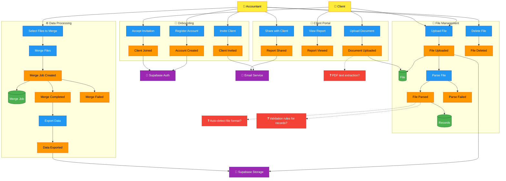

# Big Picture: EventStorming Overview

This diagram shows the entire system at a glance using **EventStorming** methodology.

## Color Legend

| Color | Element | Description |
|-------|---------|-------------|
| 🟡 Yellow | **Actor** | Who initiates actions (Accountant, Client) |
| 🔵 Blue | **Command** | Actions users take (Upload File, Merge Files) |
| 🟠 Orange | **Event** | Things that happen (File Uploaded, Merge Completed) |
| 🟢 Green | **Aggregate** | Data entities that change (File, Records, Merge Job) |
| 🟣 Purple | **External System** | Third-party services (Supabase, Email) |
| 🔴 Red | **Hotspot** | Open questions needing decisions |

## System Overview

## Key Flows

### 1. Onboarding Flow
1. Accountant registers → Account created in Supabase Auth
2. Accountant invites client → Email sent
3. Client accepts invitation → Joins platform

### 2. File Management Flow
1. User (accountant or client) uploads file → Stored in Supabase Storage
2. System parses Excel/CSV → Records extracted to database
3. If parse fails → Error recorded, user notified

### 3. Data Processing Flow
1. Accountant selects multiple files → Creates merge job
2. System merges data → Detects overlaps, calculates stats
3. Accountant exports → Downloads Excel/CSV or views HTML report

### 4. Client Portal Flow
1. Client uploads documents → Stored for accountant review
2. Accountant shares reports → Client notified via email
3. Client views shared reports → Read-only access

## Hotspots (Decisions Needed)

| Hotspot | Question | Recommendation |
|---------|----------|----------------|
| H1 | How to auto-detect file format? | Check header patterns (Hami stam vs Zubeks) |
| H2 | What validation rules for records? | Required: Налог, Дата; Numeric: Долгува, Побарува |
| H3 | Should PDFs have text extraction? | MVP: Store only, Post-MVP: OCR |
