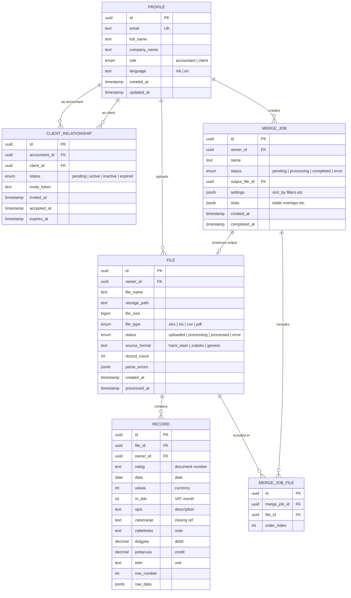

# Entity Relationship Diagram

This diagram shows all data entities in the system and their relationships.

## Overview

The platform has **6 main entities**:
- **Profile** - Users (accountants and clients)
- **Client Relationship** - Links accountants to their clients
- **File** - Uploaded Excel/CSV/PDF files
- **Record** - Parsed data rows from Excel/CSV files
- **Merge Job** - A job that combines multiple files
- **Merge Job File** - Links files to merge jobs (many-to-many)

## Entity Relationships

## Entity Details

### PROFILE
Extends Supabase `auth.users`. Stores additional user information.

| Field | Type | Description |
|-------|------|-------------|
| id | UUID | Primary key (from auth.users) |
| email | TEXT | User's email (unique) |
| full_name | TEXT | Display name |
| company_name | TEXT | Business name |
| role | ENUM | `accountant` or `client` |
| language | TEXT | `mk` or `en` |

### CLIENT_RELATIONSHIP
Links accountants to their clients. An accountant can have many clients.

| Field | Type | Description |
|-------|------|-------------|
| accountant_id | UUID | The accountant |
| client_id | UUID | The client |
| status | ENUM | `pending`, `active`, `inactive`, `expired` |
| invite_token | TEXT | Token sent in invitation email |

### FILE
Represents an uploaded file (Excel, CSV, or PDF).

| Field | Type | Description |
|-------|------|-------------|
| owner_id | UUID | Who uploaded it |
| file_name | TEXT | Original filename |
| storage_path | TEXT | Path in Supabase Storage |
| file_type | ENUM | `xlsx`, `xls`, `csv`, `pdf` |
| status | ENUM | `uploaded`, `processing`, `processed`, `error` |
| source_format | TEXT | Detected format (e.g., `hami_stam`) |
| record_count | INT | Number of records extracted |

### RECORD
A single row of data parsed from an Excel/CSV file. Matches the accounting ledger format.

| Field | Type | Description (Macedonian) |
|-------|------|-------------|
| nalog | TEXT | Налог - Document number |
| data | DATE | Дата - Date |
| valuta | INT | Вал. - Currency code |
| m_ddv | INT | м.ддв - VAT month |
| opis | TEXT | Опис - Description |
| zatvoranje | TEXT | Затворање - Closing reference |
| zabeleska | TEXT | Забелешка - Note |
| dolgува | DECIMAL | Долгува - Debit amount |
| pobaruva | DECIMAL | Побарува - Credit amount |
| edin | TEXT | Един - Unit |

### MERGE_JOB
Represents a merge operation combining multiple files.

| Field | Type | Description |
|-------|------|-------------|
| owner_id | UUID | Accountant who created it |
| status | ENUM | `pending`, `processing`, `completed`, `error` |
| output_file_id | UUID | Generated output file |
| stats | JSONB | Calculated statistics (totals, overlaps) |

## Relationship Summary

| From | To | Type | Description |
|------|----|------|-------------|
| Profile | File | 1:N | User uploads many files |
| Profile | Client Relationship | 1:N | Accountant has many client links |
| Profile | Merge Job | 1:N | Accountant creates many merge jobs |
| File | Record | 1:N | File contains many records |
| Merge Job | File | N:M | Merge job includes many files (via MERGE_JOB_FILE) |
| Merge Job | File | 1:1 | Merge job produces one output file |
