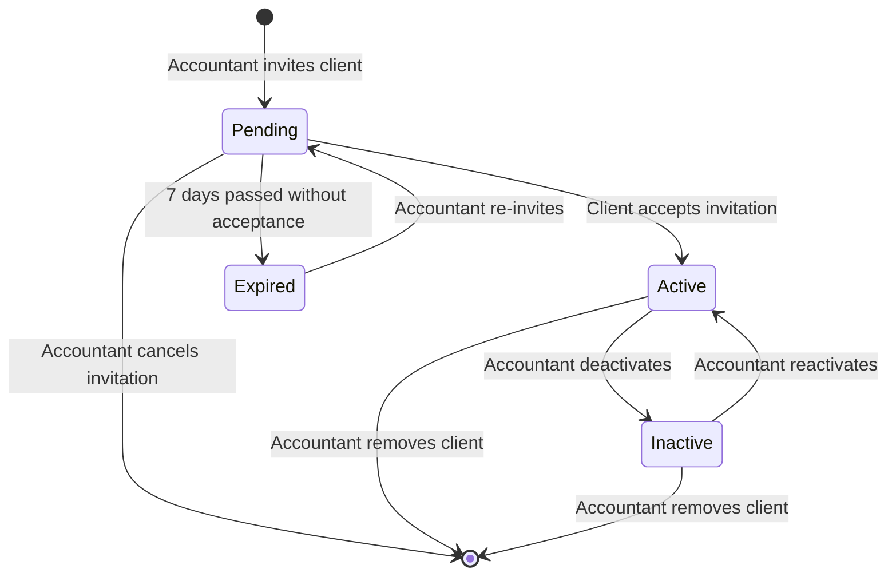

# Client Relationship State Chart

This diagram shows the lifecycle of an **Accountant-Client Relationship** from invitation to removal.

## States

| State | Description |
|-------|-------------|
| **Pending** | Invitation sent, waiting for client to accept |
| **Active** | Client accepted, full collaboration enabled |
| **Inactive** | Temporarily disabled by accountant |
| **Expired** | Invitation timed out (7 days) |

## State Diagram

## Transitions

| From | To | Trigger | Actions |
|------|----|---------|---------|
| - | Pending | Accountant invites | Create relationship, generate token, send email |
| Pending | Active | Client clicks link & registers | Create client profile, update relationship |
| Pending | Expired | 7 days pass | Automatic (cron job or check on access) |
| Pending | (deleted) | Accountant cancels | Delete relationship record |
| Expired | Pending | Accountant re-invites | Generate new token, send new email |
| Active | Inactive | Accountant deactivates | Update status, client loses access |
| Active | (deleted) | Accountant removes | Delete relationship, client keeps account |
| Inactive | Active | Accountant reactivates | Update status, client regains access |

## Business Rules

1. **Invitation expiry**: Invitations expire after 7 days for security
2. **Re-invite allowed**: Expired invitations can be resent
3. **Soft deactivation**: Inactive status preserves history but blocks access
4. **Client account persists**: Removing relationship doesn't delete client's account
5. **One accountant per client**: MVP limits clients to one accountant (future: multiple)

## Access Control by State

| State | Client Can Upload | Client Can View Reports | Accountant Sees Client |
|-------|-------------------|------------------------|------------------------|
| Pending | ❌ No | ❌ No | ✅ Yes (pending) |
| Active | ✅ Yes | ✅ Yes | ✅ Yes |
| Inactive | ❌ No | ❌ No | ✅ Yes (inactive) |
| Expired | ❌ No | ❌ No | ✅ Yes (expired) |

## Email Notifications

| Transition | Email Sent To | Content |
|------------|---------------|---------|
| → Pending | Client | Invitation link with token |
| Pending → Active | Accountant | "Client X has joined" |
| Pending → Expired | Accountant | "Invitation to X expired" |
| → Active (re-shared report) | Client | "New report shared" |
