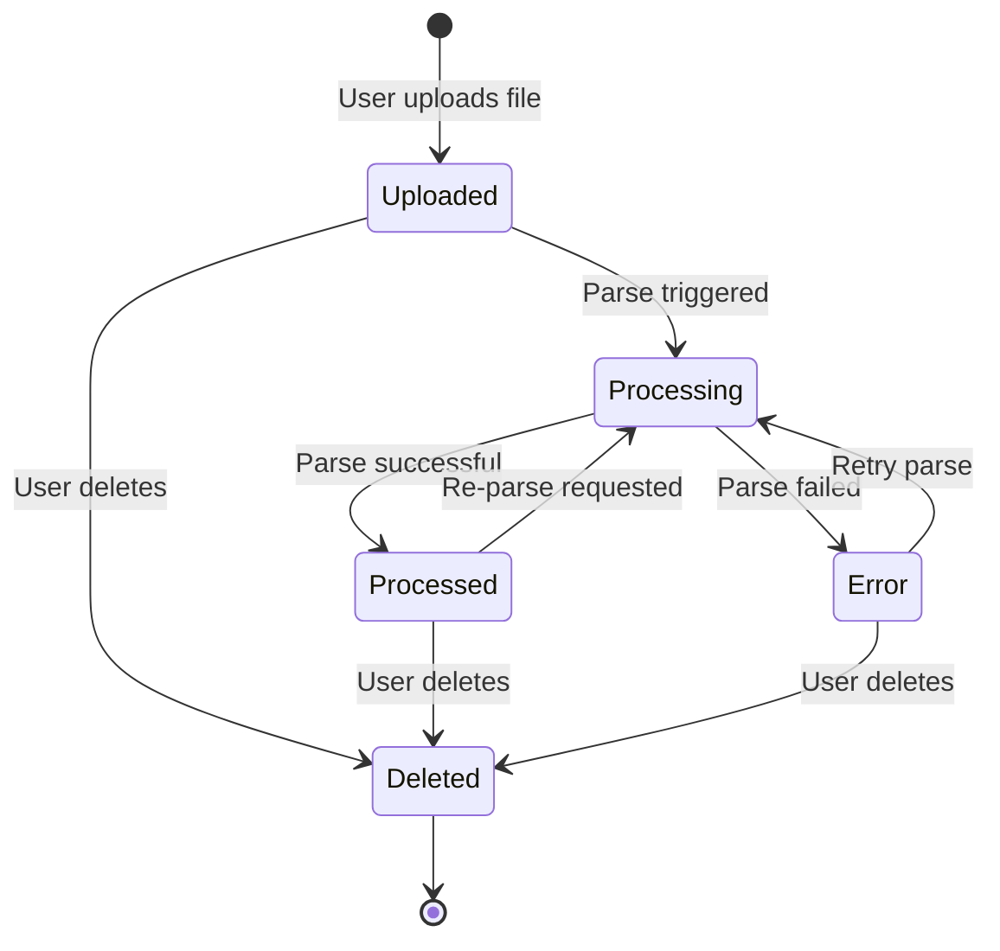

# File State Chart

This diagram shows the lifecycle of a **File** entity from upload to deletion.

## States

| State | Description |
|-------|-------------|
| **Uploaded** | File stored in Supabase Storage, awaiting parsing |
| **Processing** | Excel/CSV being parsed, records being extracted |
| **Processed** | Parse complete, records stored in database |
| **Error** | Parse failed, error details available |
| **Deleted** | File removed from system |

## State Diagram

## Transitions

| From | To | Trigger | Actions |
|------|----|---------|---------|
| - | Uploaded | User uploads file | Store in Supabase Storage, create DB record |
| Uploaded | Processing | Automatic after upload | Start Excel parser |
| Processing | Processed | Parse succeeds | Insert records, update record_count |
| Processing | Error | Parse fails | Store error details in parse_errors |
| Processed | Deleted | User clicks delete | Remove file from Storage, cascade delete records |
| Error | Processing | User clicks retry | Re-run parser |
| Error | Deleted | User clicks delete | Remove file from Storage |

## Business Rules

1. **Auto-parse on upload**: When a file is uploaded, parsing starts automatically
2. **Retry allowed**: Users can retry failed parses (useful if format detection improves)
3. **Re-parse allowed**: Users can re-parse processed files (useful if parser logic changes)
4. **Cascade delete**: Deleting a file removes all associated records
5. **PDFs skip parsing**: PDF files go directly to `Processed` with `record_count = 0`

## File Status in UI

| Status | Color | Icon | User Actions Available |
|--------|-------|------|------------------------|
| Uploaded | Gray | ⏳ | Delete |
| Processing | Blue | 🔄 | (wait) |
| Processed | Green | ✅ | View records, Include in merge, Delete |
| Error | Red | ❌ | View error, Retry, Delete |
