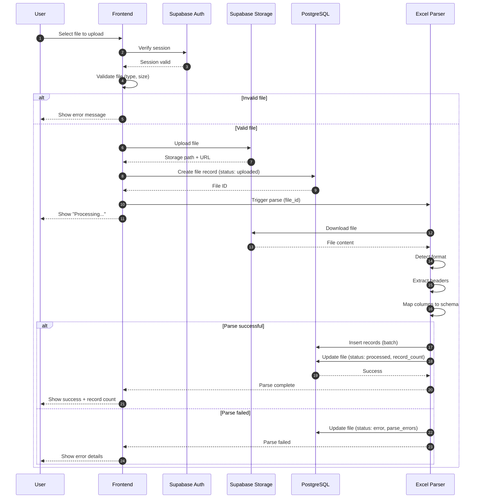

# Sequence: File Upload Flow

This diagram shows the technical interaction between components when a user uploads a file.

## Participants

| Participant | Description |
|-------------|-------------|
| User | Accountant or Client using the web app |
| Frontend | Next.js application |
| Supabase Auth | Authentication service |
| Supabase Storage | File storage service |
| PostgreSQL | Database |
| Excel Parser | File parsing logic (client-side or Edge Function) |

## Sequence Diagram



## Step Details

### 1-2: Session Verification
```typescript
// Frontend checks if user is authenticated
const { data: { session } } = await supabase.auth.getSession()
if (!session) redirect('/login')
```

### 3: Client-Side Validation
```typescript
const MAX_SIZE = 10 * 1024 * 1024 // 10MB
const ALLOWED_TYPES = ['xlsx', 'xls', 'csv', 'pdf']

function validateFile(file: File): boolean {
  if (file.size > MAX_SIZE) return false
  const ext = file.name.split('.').pop()?.toLowerCase()
  return ALLOWED_TYPES.includes(ext)
}
```

### 4-5: Upload to Storage
```typescript
const path = `uploads/${user.id}/${Date.now()}_${file.name}`
const { data, error } = await supabase.storage
  .from('uploads')
  .upload(path, file)
```

### 6-7: Create Database Record
```typescript
const { data: fileRecord } = await supabase
  .from('files')
  .insert({
    owner_id: user.id,
    file_name: file.name,
    storage_path: path,
    file_size: file.size,
    file_type: getFileType(file.name),
    status: 'uploaded'
  })
  .select()
  .single()
```

### 8-15: Parse File
Can be done client-side (xlsx library) or server-side (Edge Function):

```typescript
// Using xlsx library
import * as XLSX from 'xlsx'

async function parseExcel(fileUrl: string) {
  const response = await fetch(fileUrl)
  const buffer = await response.arrayBuffer()
  const workbook = XLSX.read(buffer)
  const sheet = workbook.Sheets[workbook.SheetNames[0]]
  const data = XLSX.utils.sheet_to_json(sheet, { header: 1 })

  // Detect headers, map columns, extract records
  return extractRecords(data)
}
```

### 16-17: Batch Insert Records
```typescript
// Insert records in batches of 100
const BATCH_SIZE = 100
for (let i = 0; i < records.length; i += BATCH_SIZE) {
  const batch = records.slice(i, i + BATCH_SIZE)
  await supabase.from('records').insert(batch)
}

// Update file status
await supabase
  .from('files')
  .update({
    status: 'processed',
    record_count: records.length,
    processed_at: new Date().toISOString()
  })
  .eq('id', fileId)
```

## Error Handling

| Error | Response Code | User Message |
|-------|---------------|--------------|
| File too large | 413 | "File exceeds 10MB limit" |
| Invalid type | 415 | "Only Excel, CSV, and PDF files allowed" |
| Storage full | 507 | "Storage quota exceeded" |
| Parse failed | 422 | "Could not parse file. Check format." |
| Network error | 503 | "Upload failed. Please try again." |

## Performance Considerations

| Concern | Solution |
|---------|----------|
| Large files | Stream upload, show progress bar |
| Many records | Batch inserts (100 at a time) |
| Slow parsing | Show spinner, parse in background |
| Duplicate uploads | Check file hash before uploading |
