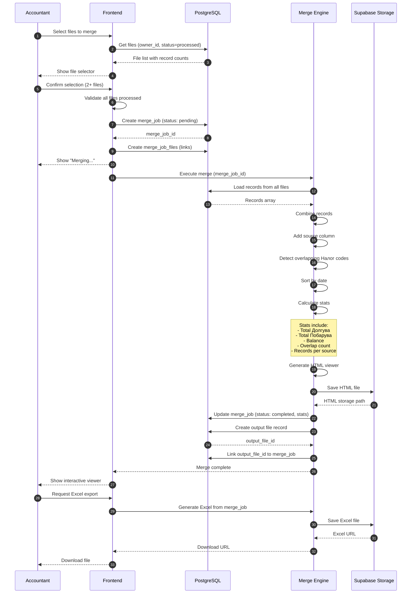

# Sequence: Data Merge Flow

This diagram shows the technical interaction between components when an accountant merges multiple files.

## Participants

| Participant | Description |
|-------------|-------------|
| Accountant | User performing the merge |
| Frontend | Next.js application |
| PostgreSQL | Database |
| Merge Engine | Merge logic (client-side or Edge Function) |
| Supabase Storage | For storing generated exports |

## Sequence Diagram



## Step Details

### 1-4: Load Available Files
```typescript
const { data: files } = await supabase
  .from('files')
  .select('id, file_name, record_count, source_format, created_at')
  .eq('owner_id', user.id)
  .eq('status', 'processed')
  .order('created_at', { ascending: false })
```

### 5-6: Validate Selection
```typescript
function validateSelection(selectedFiles: File[]): boolean {
  if (selectedFiles.length < 2) {
    showError('Select at least 2 files to merge')
    return false
  }
  if (selectedFiles.some(f => f.status !== 'processed')) {
    showError('All files must be processed')
    return false
  }
  return true
}
```

### 7-9: Create Merge Job
```typescript
// Create the merge job
const { data: mergeJob } = await supabase
  .from('merge_jobs')
  .insert({
    owner_id: user.id,
    name: `Merge ${new Date().toISOString()}`,
    status: 'pending',
    settings: { sort_by: 'data', include_source: true }
  })
  .select()
  .single()

// Link files to merge job
const links = selectedFileIds.map((fileId, index) => ({
  merge_job_id: mergeJob.id,
  file_id: fileId,
  order_index: index
}))
await supabase.from('merge_job_files').insert(links)
```

### 11-12: Load Records
```typescript
const { data: records } = await supabase
  .from('records')
  .select('*, files!inner(file_name)')
  .in('file_id', selectedFileIds)
```

### 13-17: Merge Logic
```typescript
function mergeRecords(records: Record[], files: File[]) {
  // Add source column
  const withSource = records.map(r => ({
    ...r,
    source: files.find(f => f.id === r.file_id)?.file_name
  }))

  // Detect overlaps
  const nalogCounts = new Map<string, number>()
  withSource.forEach(r => {
    const count = nalogCounts.get(r.nalog) || 0
    nalogCounts.set(r.nalog, count + 1)
  })
  const overlappingCodes = [...nalogCounts.entries()]
    .filter(([_, count]) => count > 1)
    .map(([code]) => code)

  // Sort by date
  const sorted = withSource.sort((a, b) =>
    new Date(a.data).getTime() - new Date(b.data).getTime()
  )

  // Calculate stats
  const stats = {
    totalRecords: sorted.length,
    totalDolgува: sorted.reduce((sum, r) => sum + (r.dolgува || 0), 0),
    totalPobarува: sorted.reduce((sum, r) => sum + (r.pobaruva || 0), 0),
    balance: 0, // calculated below
    overlapCount: overlappingCodes.length,
    overlappingCodes,
    recordsPerSource: groupBy(sorted, 'source')
  }
  stats.balance = stats.totalPobarува - stats.totalDolgува

  return { records: sorted, stats }
}
```

### 18-19: Generate HTML Viewer
Uses the same template as our prototype - self-contained HTML with embedded data and interactive features (filtering, sorting, stats).

### 20-24: Save Results
```typescript
// Update merge job with results
await supabase
  .from('merge_jobs')
  .update({
    status: 'completed',
    stats: stats,
    completed_at: new Date().toISOString()
  })
  .eq('id', mergeJob.id)

// Create output file record for the HTML
const { data: outputFile } = await supabase
  .from('files')
  .insert({
    owner_id: user.id,
    file_name: `merge_${mergeJob.id}.html`,
    storage_path: htmlPath,
    file_type: 'html',
    status: 'processed'
  })
  .select()
  .single()

// Link output to merge job
await supabase
  .from('merge_jobs')
  .update({ output_file_id: outputFile.id })
  .eq('id', mergeJob.id)
```

### 25-30: Export to Excel
```typescript
async function exportToExcel(mergeJobId: string) {
  const { data: job } = await supabase
    .from('merge_jobs')
    .select('*, merge_job_files(file_id)')
    .eq('id', mergeJobId)
    .single()

  const fileIds = job.merge_job_files.map(f => f.file_id)
  const { data: records } = await supabase
    .from('records')
    .select('*')
    .in('file_id', fileIds)

  // Generate Excel using xlsx library
  const worksheet = XLSX.utils.json_to_sheet(records)
  const workbook = XLSX.utils.book_new()
  XLSX.utils.book_append_sheet(workbook, worksheet, 'Merged Data')

  const buffer = XLSX.write(workbook, { type: 'buffer', bookType: 'xlsx' })

  // Upload to storage
  const path = `exports/${user.id}/${Date.now()}_merged.xlsx`
  await supabase.storage.from('exports').upload(path, buffer)

  // Return download URL
  const { data: { publicUrl } } = supabase.storage
    .from('exports')
    .getPublicUrl(path)

  return publicUrl
}
```

## Stats Object Structure

```typescript
interface MergeStats {
  totalRecords: number
  totalDolgува: number
  totalPobarува: number
  balance: number
  overlapCount: number
  overlappingCodes: string[]
  recordsPerSource: {
    [fileName: string]: number
  }
  dateRange: {
    from: string
    to: string
  }
}
```

## Performance Considerations

| File Count | Records | Expected Time |
|------------|---------|---------------|
| 2 files | ~50 | < 1 second |
| 5 files | ~200 | 1-2 seconds |
| 10 files | ~500 | 2-3 seconds |
| 20+ files | 1000+ | Consider background job |
