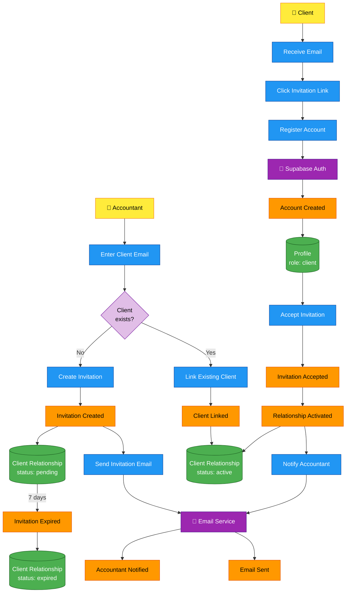

# Process: Client Invitation

This diagram details the flow when an accountant invites a client to join the platform.

## Overview

The invitation process:
1. Accountant enters client's email
2. System checks if client already exists
3. If new: sends invitation email with secure link
4. Client clicks link, registers account
5. Relationship activated, both parties notified

## Process Flow


```mermaid
flowchart TD
    classDef event fill:#ff9800,stroke:#e65100,color:#000
    classDef command fill:#2196f3,stroke:#0d47a1,color:#fff
    classDef actor fill:#ffeb3b,stroke:#f57f17,color:#000
    classDef system fill:#9c27b0,stroke:#4a148c,color:#fff
    classDef aggregate fill:#4caf50,stroke:#1b5e20,color:#fff
    classDef decision fill:#e1bee7,stroke:#7b1fa2,color:#000

    Accountant[👤 Accountant]:::actor
    Client[👤 Client]:::actor
    EmailSvc[📧 Email Service]:::system
    SupaAuth[🔐 Supabase Auth]:::system

    EnterEmail[Enter Client Email]:::command
    CheckExists{Client<br/>exists?}:::decision
    CreateInvite[Create Invitation]:::command
    InviteCreated[Invitation Created]:::event
    RelAgg[(Client Relationship<br/>status: pending)]:::aggregate
    SendEmail[Send Invitation Email]:::command
    EmailSent[Email Sent]:::event

    LinkExisting[Link Existing Client]:::command
    ClientLinked[Client Linked]:::event
    RelAggActive[(Client Relationship<br/>status: active)]:::aggregate

    ReceiveEmail[Receive Email]:::command
    ClickLink[Click Invitation Link]:::command
    RegisterAccount[Register Account]:::command
    AccountCreated[Account Created]:::event
    ProfileAgg[(Profile<br/>role: client)]:::aggregate
    AcceptInvite[Accept Invitation]:::command
    InviteAccepted[Invitation Accepted]:::event

    RelationshipActive[Relationship Activated]:::event
    NotifyAccountant[Notify Accountant]:::command
    AccountantNotified[Accountant Notified]:::event

    InviteExpired[Invitation Expired]:::event
    RelAggExpired[(Client Relationship<br/>status: expired)]:::aggregate

    Accountant --> EnterEmail
    EnterEmail --> CheckExists
    CheckExists -->|Yes| LinkExisting
    LinkExisting --> ClientLinked
    ClientLinked --> RelAggActive

    CheckExists -->|No| CreateInvite
    CreateInvite --> InviteCreated
    InviteCreated --> RelAgg
    InviteCreated --> SendEmail
    SendEmail --> EmailSvc
    EmailSvc --> EmailSent

    Client --> ReceiveEmail
    ReceiveEmail --> ClickLink
    ClickLink --> RegisterAccount
    RegisterAccount --> SupaAuth
    SupaAuth --> AccountCreated
    AccountCreated --> ProfileAgg
    ProfileAgg --> AcceptInvite
    AcceptInvite --> InviteAccepted
    InviteAccepted --> RelationshipActive
    RelationshipActive --> RelAggActive
    RelationshipActive --> NotifyAccountant
    NotifyAccountant --> EmailSvc
    EmailSvc --> AccountantNotified

    RelAgg -->|7 days| InviteExpired
    InviteExpired --> RelAggExpired
```

## Step-by-Step

### Accountant Side

#### 1. Enter Client Email
- Accountant goes to "Clients" → "Invite New Client"
- Enters client's email address
- Optionally adds client's company name

#### 2. System Check
- If email exists in system → Link existing client (skip invitation)
- If email is new → Create invitation

#### 3. Create Invitation
```
client_relationship = {
    accountant_id: current_user.id,
    client_id: null,  // Not yet created
    status: "pending",
    invite_token: generate_secure_token(),
    invited_at: now(),
    expires_at: now() + 7 days
}
```

#### 4. Send Email
Email contains:
- Accountant's name and company
- Invitation link: `https://app.com/invite/{token}`
- Expiration notice (7 days)

### Client Side

#### 5. Receive & Click Link
- Client receives email
- Clicks invitation link
- Redirected to registration page

#### 6. Register Account
- Client fills registration form:
  - Email (pre-filled from invitation)
  - Password
  - Full name
  - Company name
- Supabase Auth creates account

#### 7. Accept Invitation
- System validates token
- Creates profile with `role: client`
- Updates relationship: `status: active`, `client_id: new_user.id`

#### 8. Notify Accountant
- Email sent to accountant: "Client X has joined"
- Dashboard shows new active client

## Email Templates

### Invitation Email (to Client)

```
Subject: [Accountant Name] has invited you to Сметководствена Платформа

Здраво,

[Accountant Name] од [Company] ве покани да се приклучите на
Сметководствена Платформа за да ги споделувате вашите
финансиски документи.

[Accept Invitation Button]

Оваа покана истекува за 7 дена.

---

Hello,

[Accountant Name] from [Company] has invited you to join
Accounting Platform to share your financial documents.

[Accept Invitation Button]

This invitation expires in 7 days.
```

### Confirmation Email (to Accountant)

```
Subject: [Client Name] has joined your client list

[Client Name] ([Client Email]) has accepted your invitation
and is now connected to your account.

[View Client Button]
```

## Security Considerations

| Concern | Mitigation |
|---------|------------|
| Token guessing | 32-character secure random token |
| Token reuse | Single-use, invalidated after acceptance |
| Expiration | 7-day limit, automatic expiry |
| Email spoofing | Verify token matches email in DB |
| Existing user hijack | Require password confirmation if linking existing |

## Edge Cases

| Scenario | Handling |
|----------|----------|
| Client already invited (pending) | Show error, offer to resend |
| Client already connected (active) | Show error, already connected |
| Token expired | Show error, suggest accountant re-invite |
| Invalid token | Show error, generic "invalid link" |
| Client registers with different email | Token won't match, must use correct email |
