# Process: Data Merge

This diagram details the flow when an accountant merges multiple files into a combined dataset.

## Overview

The merge process:
1. Accountant selects 2+ processed files
2. System creates a merge job
3. Records from all files are combined
4. Overlapping Налог codes are detected
5. Source column added to identify origin
6. Statistics calculated (totals, balance)
7. Interactive HTML viewer generated
8. Export to Excel/CSV available

## Process Flow

```mermaid
flowchart TD
    classDef event fill:#ff9800,stroke:#e65100,color:#000
    classDef command fill:#2196f3,stroke:#0d47a1,color:#fff
    classDef actor fill:#ffeb3b,stroke:#f57f17,color:#000
    classDef aggregate fill:#4caf50,stroke:#1b5e20,color:#fff
    classDef decision fill:#e1bee7,stroke:#7b1fa2,color:#000

    Accountant[👤 Accountant]:::actor

    SelectFiles[Select Files to Merge]:::command
    FilesSelected[Files Selected]:::event
    ValidateFiles{All files<br/>parsed?}:::decision
    InvalidSelection[Selection Invalid<br/>unparsed files]:::event

    CreateJob[Create Merge Job]:::command
    JobCreated[Merge Job Created]:::event
    MergeAgg[(Merge Job<br/>status: pending)]:::aggregate

    LoadRecords[Load Records<br/>from all files]:::command
    RecordsLoaded[Records Loaded]:::event
    DetectOverlaps[Detect Overlapping<br/>Налог codes]:::command
    OverlapsDetected[Overlaps Detected]:::event
    AddSourceColumn[Add Source<br/>Identifier Column]:::command
    SortByDate[Sort by Date]:::command
    CalculateStats[Calculate<br/>Financial Stats]:::command

    StatsAgg[(Stats<br/>- Total Долгува<br/>- Total Побарува<br/>- Balance<br/>- Overlap count)]:::aggregate

    GenerateOutput[Generate Merged<br/>Dataset]:::command
    MergeCompleted[Merge Completed]:::event
    MergeAggDone[(Merge Job<br/>status: completed)]:::aggregate

    ViewInteractive[View Interactive<br/>HTML Report]:::command
    ExportExcel[Export to Excel]:::command
    ExportCSV[Export to CSV]:::command
    DataExported[Data Exported]:::event

    MergeFailed[Merge Failed]:::event
    MergeAggError[(Merge Job<br/>status: error)]:::aggregate

    Accountant --> SelectFiles
    SelectFiles --> FilesSelected
    FilesSelected --> ValidateFiles
    ValidateFiles -->|No| InvalidSelection
    ValidateFiles -->|Yes| CreateJob
    CreateJob --> JobCreated
    JobCreated --> MergeAgg

    MergeAgg --> LoadRecords
    LoadRecords --> RecordsLoaded
    RecordsLoaded --> DetectOverlaps
    DetectOverlaps --> OverlapsDetected
    OverlapsDetected --> AddSourceColumn
    AddSourceColumn --> SortByDate
    SortByDate --> CalculateStats
    CalculateStats --> StatsAgg

    StatsAgg --> GenerateOutput
    GenerateOutput --> MergeCompleted
    GenerateOutput --> MergeFailed
    MergeCompleted --> MergeAggDone

    MergeAggDone --> ViewInteractive
    MergeAggDone --> ExportExcel
    MergeAggDone --> ExportCSV
    ExportExcel --> DataExported
    ExportCSV --> DataExported

    MergeFailed --> MergeAggError
```



## Step-by-Step

### 1. File Selection
- User selects 2 or more files from their file list
- Only files with `status: processed` can be selected
- System validates all selected files are ready

### 2. Merge Job Creation
```
merge_job = {
    owner_id: current_user.id,
    status: "pending",
    file_ids: [file1.id, file2.id, ...],
    settings: { sort_by: "data", include_source: true }
}
```

### 3. Load & Combine Records
- Query all records from selected files
- Combine into single dataset
- Add `source_file` column with original filename

### 4. Detect Overlaps
- Find Налог codes that appear in multiple files
- These are NOT duplicates - they're the same document reference from different sources
- Example: Invoice `10-0057` appears in both Hami stam and Zubeks

### 5. Calculate Statistics

| Statistic | Calculation |
|-----------|-------------|
| Total Долгува | SUM of all debit amounts |
| Total Побарува | SUM of all credit amounts |
| Balance | Побарува - Долгува |
| Record Count | Total rows |
| Overlap Count | Count of shared Налог codes |
| Records per Source | Group by source file |

### 6. Generate Output
- **HTML Viewer**: Interactive table with filters, sorting, color-coding
- **Stats Section**: Financial summary at top
- **Source Identification**: Each row shows which file it came from

### 7. Export Options

| Format | Content |
|--------|---------|
| HTML | Interactive viewer (self-contained, works offline) |
| Excel (.xlsx) | Full data with formatting |
| CSV | Plain data for import to other systems |

## Example: Merge Result

From our prototype (Hami stam + Zubeks):

| Metric | Value |
|--------|-------|
| Files merged | 2 |
| Total records | 50 |
| Overlapping codes | 8 |
| Total Долгува | 154,728 |
| Total Побарува | 154,728 |
| Balance | 0 (settled) |

## UI Mockup

```
┌─────────────────────────────────────────────────┐
│ Select Files to Merge                           │
├─────────────────────────────────────────────────┤
│ ☑ Hami stam.xlsx    (25 records)   ✅ Processed │
│ ☑ Zubeks.xlsx       (25 records)   ✅ Processed │
│ ☐ Invoice_2024.pdf  (0 records)    📄 PDF       │
├─────────────────────────────────────────────────┤
│              [ Merge Selected Files ]           │
└─────────────────────────────────────────────────┘
```
