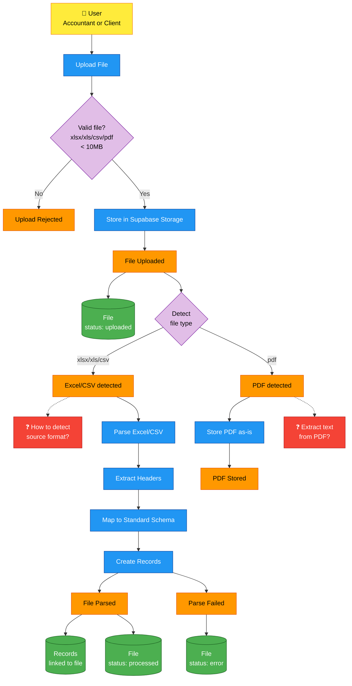

# Process: File Upload & Parse

This diagram details the complete flow when a user uploads a file to the platform.

## Overview

When a user uploads an Excel, CSV, or PDF file:
1. File is validated (type, size)
2. File is stored in Supabase Storage
3. File metadata is saved to database
4. For Excel/CSV: automatic parsing extracts records
5. For PDF: stored as-is (no parsing in MVP)

## Process Flow

```mermaid
flowchart TD
    classDef event fill:#ff9800,stroke:#e65100,color:#000
    classDef command fill:#2196f3,stroke:#0d47a1,color:#fff
    classDef actor fill:#ffeb3b,stroke:#f57f17,color:#000
    classDef aggregate fill:#4caf50,stroke:#1b5e20,color:#fff
    classDef decision fill:#e1bee7,stroke:#7b1fa2,color:#000
    classDef hotspot fill:#f44336,stroke:#b71c1c,color:#fff

    User[👤 User<br/>Accountant or Client]:::actor

    Upload[Upload File]:::command
    Validate{Valid file?<br/>xlsx/xls/csv/pdf<br/>< 10MB}:::decision
    Invalid[Upload Rejected]:::event
    Store[Store in Supabase Storage]:::command
    FileUploaded[File Uploaded]:::event
    FileAgg[(File<br/>status: uploaded)]:::aggregate

    Detect{Detect<br/>file type}:::decision
    IsExcel[Excel/CSV detected]:::event
    IsPDF[PDF detected]:::event
    HotDetect[❓ How to detect<br/>source format?]:::hotspot

    Parse[Parse Excel/CSV]:::command
    ExtractHeaders[Extract Headers]:::command
    MapColumns[Map to Standard Schema]:::command
    CreateRecords[Create Records]:::command
    FileParsed[File Parsed]:::event
    RecordsAgg[(Records<br/>linked to file)]:::aggregate
    FileAggParsed[(File<br/>status: processed)]:::aggregate

    StorePDF[Store PDF as-is]:::command
    PDFStored[PDF Stored]:::event
    HotPDF[❓ Extract text<br/>from PDF?]:::hotspot

    ParseError[Parse Failed]:::event
    FileAggError[(File<br/>status: error)]:::aggregate

    User --> Upload
    Upload --> Validate
    Validate -->|No| Invalid
    Validate -->|Yes| Store
    Store --> FileUploaded
    FileUploaded --> FileAgg
    FileUploaded --> Detect

    Detect -->|xlsx/xls/csv| IsExcel
    Detect -->|pdf| IsPDF

    IsExcel --> Parse
    IsExcel -.-> HotDetect
    Parse --> ExtractHeaders
    ExtractHeaders --> MapColumns
    MapColumns --> CreateRecords
    CreateRecords --> FileParsed
    CreateRecords --> ParseError
    FileParsed --> RecordsAgg
    FileParsed --> FileAggParsed

    IsPDF --> StorePDF
    IsPDF -.-> HotPDF
    StorePDF --> PDFStored

    ParseError --> FileAggError
```

## Step-by-Step

### 1. Validation
| Check | Rule | Error Message |
|-------|------|---------------|
| File type | Must be .xlsx, .xls, .csv, or .pdf | "Unsupported file type" |
| File size | Must be < 10MB | "File too large (max 10MB)" |
| File name | Must not be empty | "Invalid file name" |

### 2. Storage
- Upload to Supabase Storage bucket: `uploads/{user_id}/{timestamp}_{filename}`
- Create file record in database with `status: uploaded`

### 3. Format Detection
For Excel/CSV files, detect the source format by checking headers:

| Source Format | Detection Pattern |
|---------------|-------------------|
| `hami_stam` | Headers include specific Hami stam patterns |
| `zubeks` | Headers include specific Zubeks patterns |
| `generic` | Standard accounting columns detected |
| `unknown` | Cannot detect, use generic mapping |

### 4. Parsing (Excel/CSV only)
1. **Extract headers**: Read first few rows to find column headers
2. **Map columns**: Match headers to standard schema (Налог, Дата, etc.)
3. **Create records**: Insert each data row as a Record entity
4. **Update file**: Set `status: processed`, `record_count: N`

### 5. Error Handling
If parsing fails:
- Set `status: error`
- Store error details in `parse_errors` JSON field
- User can retry or delete

## Column Mapping

| Standard Field | Possible Headers (MK) | Possible Headers (EN) |
|----------------|----------------------|----------------------|
| nalog | Налог, Број | Number, Doc# |
| data | Дата, Датум | Date |
| opis | Опис, Опис на трансакција | Description |
| dolgува | Долгува, Дебит | Debit |
| pobaruva | Побарува, Кредит | Credit |

## Hotspots

| Question | Current Decision | Future Consideration |
|----------|------------------|---------------------|
| How to detect source format? | Check header patterns | ML-based detection |
| What if columns don't match? | Mark as `unknown`, use generic | Ask user to map columns |
| Extract text from PDF? | No (MVP) | OCR integration post-MVP |
