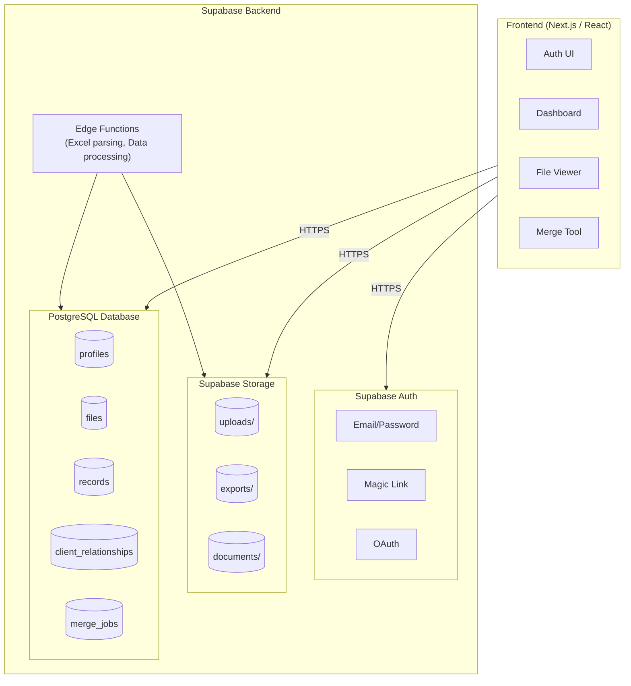
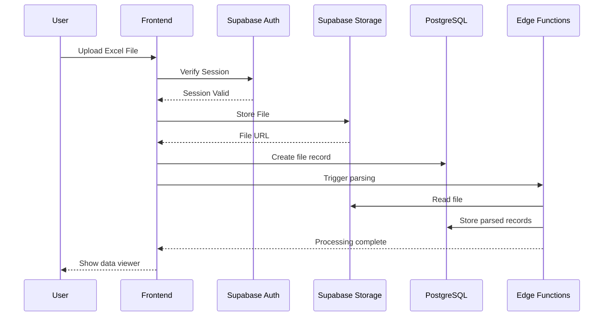
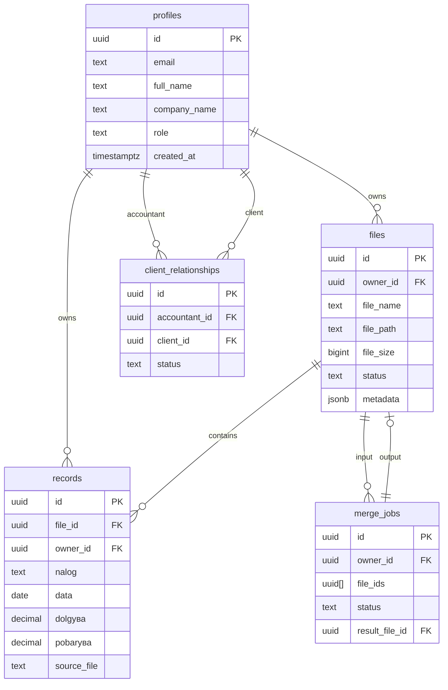

# Сметководствена Платформа МК (Accounting Platform MK)
## MVP System Design & Implementation Plan

---

## 1. Problem Statement

### Current State in Macedonia
- Most accounting firms use **outdated desktop software** (some from 2014 or earlier)
- Heavy reliance on **paper documents** and manual data entry
- Software generates **Excel files** that are hard to consolidate
- No collaboration between accountants and their clients
- Data is siloed on individual PCs with no backup/cloud access
- No remote work capability

### Pain Points
| Stakeholder | Pain Point |
|-------------|------------|
| Accountants | Manual consolidation of Excel files from multiple sources |
| Accountants | No way to share data with clients securely |
| Accountants | Risk of data loss (local storage only) |
| Clients | No visibility into their accounting status |
| Clients | Must physically deliver documents or email sensitive files |

---

## 2. Solution: Cloud-Based Accounting Platform

### Vision
A **web-based platform** where:
- Accountants can upload, process, and manage client data
- Clients can upload documents and view their financial status
- Data is securely stored in the cloud (Supabase)
- Excel import/export maintains compatibility with legacy systems

### MVP Scope
Focus on **one proven use case first**: Excel file merging and viewing (prototype already built)

---

## 3. Target Users

### Primary: Accountants (Сметководители)
- Small to medium accounting firms in Macedonia
- Currently using desktop software + Excel
- Need to consolidate data from multiple clients/sources

### Secondary: Clients of Accountants (Клиенти)
- Businesses that work with accounting firms
- Need to submit invoices/documents
- Want visibility into their financial status

---

## 4. MVP Features (Priority Order)

### Phase 1: Core Infrastructure (Week 1-2)
| Feature | Description | Priority |
|---------|-------------|----------|
| Auth System | Accountant registration/login via Supabase Auth | P0 |
| User Roles | Two roles: `accountant`, `client` | P0 |
| Dashboard | Basic landing page after login | P0 |

### Phase 2: File Management (Week 3-4)
| Feature | Description | Priority |
|---------|-------------|----------|
| File Upload | Upload Excel files (.xlsx, .xls) | P0 |
| File Storage | Store in Supabase Storage with metadata in DB | P0 |
| File List | View uploaded files with date, size, status | P0 |
| File Download | Download original files | P1 |

### Phase 3: Data Processing (Week 5-6)
| Feature | Description | Priority |
|---------|-------------|----------|
| Excel Parser | Parse uploaded Excel files into structured data | P0 |
| Data Merge | Merge multiple files (like our prototype) | P0 |
| Interactive Viewer | HTML viewer with filters (like our prototype) | P0 |
| Export | Export merged data as Excel/CSV | P1 |

### Phase 4: Client Portal (Week 7-8)
| Feature | Description | Priority |
|---------|-------------|----------|
| Client Invite | Accountant invites client via email | P1 |
| Client Upload | Clients can upload their invoices/documents | P1 |
| Status View | Clients see their financial summary | P2 |
| Notifications | Email notifications for new uploads | P2 |

---

## 5. System Architecture



### Data Flow Diagram



### Entity Relationship Diagram



---

## 6. Database Schema (Supabase PostgreSQL)

### Core Tables

```sql
-- Users (extends Supabase auth.users)
CREATE TABLE public.profiles (
    id UUID PRIMARY KEY REFERENCES auth.users(id) ON DELETE CASCADE,
    email TEXT NOT NULL,
    full_name TEXT,
    company_name TEXT,
    role TEXT NOT NULL CHECK (role IN ('accountant', 'client')),
    created_at TIMESTAMPTZ DEFAULT NOW(),
    updated_at TIMESTAMPTZ DEFAULT NOW()
);

-- Accountant-Client Relationships
CREATE TABLE public.client_relationships (
    id UUID PRIMARY KEY DEFAULT gen_random_uuid(),
    accountant_id UUID REFERENCES public.profiles(id) ON DELETE CASCADE,
    client_id UUID REFERENCES public.profiles(id) ON DELETE CASCADE,
    status TEXT DEFAULT 'pending' CHECK (status IN ('pending', 'active', 'inactive')),
    created_at TIMESTAMPTZ DEFAULT NOW(),
    UNIQUE(accountant_id, client_id)
);

-- Uploaded Files
CREATE TABLE public.files (
    id UUID PRIMARY KEY DEFAULT gen_random_uuid(),
    owner_id UUID REFERENCES public.profiles(id) ON DELETE CASCADE,
    file_name TEXT NOT NULL,
    file_path TEXT NOT NULL,  -- Supabase Storage path
    file_size BIGINT,
    file_type TEXT,  -- 'xlsx', 'xls', 'csv', 'pdf'
    status TEXT DEFAULT 'uploaded' CHECK (status IN ('uploaded', 'processing', 'processed', 'error')),
    source_type TEXT,  -- 'hami_stam', 'zubeks', 'generic', etc.
    metadata JSONB,  -- Flexible metadata storage
    created_at TIMESTAMPTZ DEFAULT NOW(),
    updated_at TIMESTAMPTZ DEFAULT NOW()
);

-- Parsed Records (from Excel files)
CREATE TABLE public.records (
    id UUID PRIMARY KEY DEFAULT gen_random_uuid(),
    file_id UUID REFERENCES public.files(id) ON DELETE CASCADE,
    owner_id UUID REFERENCES public.profiles(id) ON DELETE CASCADE,

    -- Standard accounting fields
    nalog TEXT,           -- Налог (document number)
    data DATE,            -- Дата (date)
    valuta INT,           -- Вал. (currency)
    m_ddv INT,            -- м.ддв (VAT month)
    opis TEXT,            -- Опис (description)
    zatvoranje TEXT,      -- Затворање (closing reference)
    zabeleska TEXT,       -- Забелешка (note)
    dolgува DECIMAL(15,2), -- Долгува (debit)
    pobarува DECIMAL(15,2), -- Побарува (credit)

    source_file TEXT,     -- Which file this came from
    raw_data JSONB,       -- Original row data for flexibility
    created_at TIMESTAMPTZ DEFAULT NOW()
);

-- Merge Jobs
CREATE TABLE public.merge_jobs (
    id UUID PRIMARY KEY DEFAULT gen_random_uuid(),
    owner_id UUID REFERENCES public.profiles(id) ON DELETE CASCADE,
    file_ids UUID[],      -- Array of file IDs being merged
    status TEXT DEFAULT 'pending' CHECK (status IN ('pending', 'processing', 'completed', 'error')),
    result_file_id UUID REFERENCES public.files(id),
    settings JSONB,       -- Merge settings (sort order, filters, etc.)
    created_at TIMESTAMPTZ DEFAULT NOW(),
    completed_at TIMESTAMPTZ
);

-- Create indexes for performance
CREATE INDEX idx_files_owner ON public.files(owner_id);
CREATE INDEX idx_records_file ON public.records(file_id);
CREATE INDEX idx_records_owner ON public.records(owner_id);
CREATE INDEX idx_records_nalog ON public.records(nalog);
CREATE INDEX idx_records_data ON public.records(data);
```

### Row Level Security (RLS) Policies

```sql
-- Enable RLS
ALTER TABLE public.profiles ENABLE ROW LEVEL SECURITY;
ALTER TABLE public.files ENABLE ROW LEVEL SECURITY;
ALTER TABLE public.records ENABLE ROW LEVEL SECURITY;

-- Users can only see their own profile
CREATE POLICY "Users can view own profile" ON public.profiles
    FOR SELECT USING (auth.uid() = id);

-- Users can only see their own files
CREATE POLICY "Users can view own files" ON public.files
    FOR SELECT USING (auth.uid() = owner_id);

CREATE POLICY "Users can insert own files" ON public.files
    FOR INSERT WITH CHECK (auth.uid() = owner_id);

-- Accountants can see their clients' files
CREATE POLICY "Accountants can view client files" ON public.files
    FOR SELECT USING (
        EXISTS (
            SELECT 1 FROM public.client_relationships
            WHERE accountant_id = auth.uid()
            AND client_id = files.owner_id
            AND status = 'active'
        )
    );
```

---

## 7. Tech Stack

### Frontend
| Technology | Purpose |
|------------|---------|
| **Next.js 14** | React framework with App Router |
| **TypeScript** | Type safety |
| **Tailwind CSS** | Styling |
| **shadcn/ui** | UI components |
| **TanStack Table** | Data tables with sorting/filtering |
| **xlsx** | Client-side Excel parsing |

### Backend (Supabase)
| Technology | Purpose |
|------------|---------|
| **Supabase Auth** | Authentication & user management |
| **Supabase Storage** | File storage |
| **PostgreSQL** | Database |
| **Edge Functions** | Server-side processing (Deno) |
| **Realtime** | Live updates (future) |

### Deployment
| Technology | Purpose |
|------------|---------|
| **Vercel** | Frontend hosting |
| **Supabase Cloud** | Backend hosting |

---

## 8. Implementation Roadmap

### Sprint 1: Foundation (Week 1-2)
- [ ] Set up Supabase project
- [ ] Create database schema
- [ ] Set up Next.js project with TypeScript
- [ ] Implement authentication (sign up, login, logout)
- [ ] Create basic dashboard layout
- [ ] Deploy initial version

### Sprint 2: File Upload (Week 3-4)
- [ ] Set up Supabase Storage buckets
- [ ] Create file upload component
- [ ] Implement file list view
- [ ] Add file metadata tracking
- [ ] File download functionality

### Sprint 3: Excel Processing (Week 5-6)
- [ ] Integrate xlsx library for parsing
- [ ] Create Excel preview component
- [ ] Implement data extraction to records table
- [ ] Build merge functionality
- [ ] Create interactive data viewer (based on prototype)

### Sprint 4: Client Features (Week 7-8)
- [ ] Client invitation system
- [ ] Client portal view
- [ ] File sharing between accountant/client
- [ ] Basic notifications
- [ ] Testing & bug fixes

---

## 9. API Endpoints (Supabase Edge Functions)

```typescript
// POST /functions/v1/parse-excel
// Parses uploaded Excel file and stores records
{
  file_id: "uuid",
  options: {
    header_row: 3,
    source_type: "hami_stam"
  }
}

// POST /functions/v1/merge-files
// Merges multiple files into one
{
  file_ids: ["uuid1", "uuid2"],
  options: {
    sort_by: "data",
    include_source: true
  }
}

// GET /functions/v1/generate-report
// Generates HTML or Excel report
{
  file_ids: ["uuid1", "uuid2"],
  format: "html" | "xlsx",
  filters: { ... }
}
```

---

## 10. Security Considerations

### Data Protection
- All data encrypted at rest (Supabase default)
- HTTPS for all communications
- Row Level Security (RLS) for data isolation
- File access controlled by ownership

### Authentication
- Email verification required
- Strong password requirements
- Session management via Supabase
- Future: 2FA for accountants

### Compliance
- GDPR considerations for EU data
- Local Macedonian regulations for financial data
- Audit logging for sensitive operations

---

## 11. Future Features (Post-MVP)

### Phase 2 Features
- [ ] PDF document upload and OCR
- [ ] Automatic invoice recognition
- [ ] Bank statement import
- [ ] Multi-language support (MK/EN)

### Phase 3 Features
- [ ] Financial reporting & dashboards
- [ ] Tax calculation helpers
- [ ] Integration with Macedonian tax authority (UJP)
- [ ] Mobile app

### Phase 4 Features
- [ ] AI-powered categorization
- [ ] Anomaly detection
- [ ] Predictive analytics
- [ ] White-label solution for accounting firms

---

## 12. Success Metrics

### MVP Launch Goals
| Metric | Target |
|--------|--------|
| Registered accountants | 10 |
| Files processed | 100 |
| Active weekly users | 5 |
| System uptime | 99% |

### 6-Month Goals
| Metric | Target |
|--------|--------|
| Registered accountants | 50 |
| Client accounts | 200 |
| Monthly file uploads | 1000 |
| Paying customers | 10 |

---

## 13. Pricing Model (Draft)

### Free Tier
- 1 accountant user
- 5 client connections
- 100MB storage
- Basic file merge

### Professional (500 MKD/month ~ €8)
- Unlimited client connections
- 5GB storage
- Advanced reports
- Email support

### Enterprise (Custom)
- Multiple accountant seats
- Unlimited storage
- Custom integrations
- Priority support
- White-label options

---

## 14. Getting Started

### Prerequisites
```bash
# Node.js 18+
node --version

# pnpm (recommended)
npm install -g pnpm
```

### Project Setup
```bash
# Create Next.js project
pnpm create next-app@latest smetkovodstvo-mk --typescript --tailwind --app

# Add dependencies
pnpm add @supabase/supabase-js @supabase/auth-helpers-nextjs
pnpm add xlsx
pnpm add @tanstack/react-table
pnpm add lucide-react

# shadcn/ui setup
pnpm dlx shadcn-ui@latest init
```

### Supabase Setup
1. Create project at supabase.com
2. Run schema.sql in SQL Editor
3. Configure Storage buckets
4. Set up RLS policies
5. Get API keys for .env.local

---

## 15. File Structure (Proposed)

```
smetkovodstvo-mk/
├── app/
│   ├── (auth)/
│   │   ├── login/page.tsx
│   │   └── register/page.tsx
│   ├── (dashboard)/
│   │   ├── layout.tsx
│   │   ├── page.tsx              # Dashboard home
│   │   ├── files/page.tsx        # File management
│   │   ├── merge/page.tsx        # Merge tool
│   │   ├── clients/page.tsx      # Client management
│   │   └── settings/page.tsx
│   ├── api/
│   │   └── ...
│   ├── layout.tsx
│   └── page.tsx                  # Landing page
├── components/
│   ├── ui/                       # shadcn components
│   ├── file-upload.tsx
│   ├── file-list.tsx
│   ├── data-viewer.tsx
│   └── ...
├── lib/
│   ├── supabase/
│   │   ├── client.ts
│   │   ├── server.ts
│   │   └── middleware.ts
│   ├── excel/
│   │   ├── parser.ts
│   │   └── merger.ts
│   └── utils.ts
├── types/
│   └── database.ts               # Supabase generated types
└── supabase/
    ├── migrations/
    └── functions/
```

---

## Document History

| Version | Date | Author | Changes |
|---------|------|--------|---------|
| 0.1 | 2025-01-29 | Stefan | Initial MVP plan |

---

## Next Steps

1. **Review this document** with stakeholders
2. **Set up Supabase project** and database
3. **Create Next.js boilerplate** with auth
4. **Port prototype** Excel viewer to React component
5. **Build file upload** functionality
6. **Test with real data** from your mom's accounting firm
